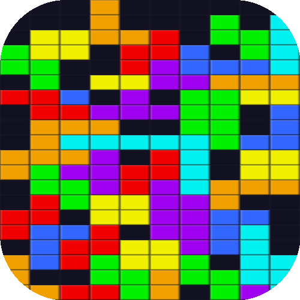

<p align="center">
  
</p>

<h1 align="center">Tetris</h1>

_A simple modern Tetris clone built with plain HTML Canvas CSS and JavaScript with no frameworks no build steps no external dependencies_

## About

This was a fun weekend project that I enjoy playing and it was very much
<a href="https://en.wikipedia.org/wiki/Vibe_coding">vibe coded</a>  
I built it primarily using:

- <a href="https://code.claude.com/docs/en/overview">Anthropic's Claude Code CLI</a>
- <a href="https://github.com/google-gemini/gemini-cli">Google's Gemini CLI</a>
- <a href="https://github.com/MehmetMHY/ch">Cha CLI</a>

## Features

- Classic 10 by 20 Tetris board with smooth controls
- Standard seven bag piece randomizer
- Hold piece and next piece previews
- Ghost piece projection
- Level based speed curve and dynamic lock delay
- Score lines level and best score tracking persisted in local storage
- Soft drop and hard drop scoring
- Pause menu with resume restart and quit to title
- Line clear flash animation
- Background music with mute and unmute toggle and mute state persisted

## How To Run

Python is required for the lightweight web server that hosts the game

From the project directory run

```bash
bash run.sh
```

The script starts a local Python HTTP server and opens the game in your browser

You can also open `index.html` directly in a browser although some browsers may restrict audio autoplay or local file APIs

## Implementation Notes

- Rendering uses pre rendered block sprites on offscreen canvases for better performance
- There is a pre rendered grid background that is blitted each frame
- Rotation uses Super Rotation System style wall kicks
- There is a simple level based timing system for gravity and lock delay
- High scores and mute state are stored with `localStorage`
- The music is from [this](https://www.youtube.com/watch?v=NmCCQxVBfyM) YouTube video

## License

Feel free to fork tweak the tuning or use this as a reference for your own Tetris experiments. Licensed under the [MIT License](./LICENSE).
