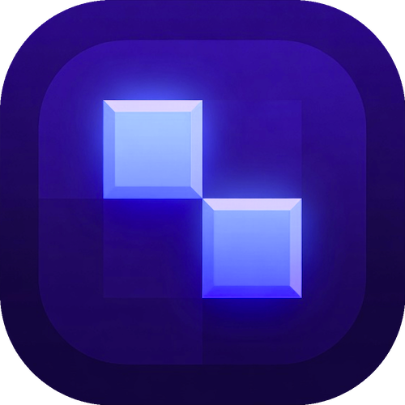

<!-- NOTE: this README was designed for GitHub's markdown renderer -->

<div id="user-content-toc" align="center">
  
  <ul>
    <summary><h1>Tetris</h1></summary>
  </ul>
</div>

## About

[Tetris](https://en.wikipedia.org/wiki/Tetris) is a legendary game and one that I enjoy very much. I really love the game and enjoy playing it; it is a great stress reliever. For a fun weekend project, I decided to build the game as a browser game/app designed for both Desktop and Mobile, using the principles of [vibe coding](https://en.wikipedia.org/wiki/Vibe_coding). The overall feel of this version of Tetris was inspired by [Play Tetris](https://play.tetris.com/).

## Features

- Classic 10x20 Tetris board
- Full keyboard controls on Desktop and touch gesture controls on Mobile
- Standard seven-bag piece randomizer
- Hold piece and next piece previews
- Ghost piece projection showing where pieces will land
- Level-based speed curve with dynamic lock delay
- Score, lines, level, and high score tracking persisted to local storage
- Soft drop and hard drop scoring
- Pause menu with resume, restart, and quit options
- Line clear flash animation
- Background music with mute toggle (state persisted)
- iOS safe area support (Dynamic Island, notch, home indicator)

## Controls

### Desktop (Keyboard)

| Action     | Keys               |
| ---------- | ------------------ |
| Move       | `←` `→` or `A` `D` |
| Soft Drop  | `↓` or `S`         |
| Hard Drop  | `Space`            |
| Rotate CW  | `↑` `W` `X`        |
| Rotate CCW | `Z`                |
| Hold       | `C` or `LShift`    |
| Mute       | `M`                |
| Pause      | `Esc` or `P`       |

### Mobile (Touch)

| Action    | Gesture            |
| --------- | ------------------ |
| Move      | Swipe left / right |
| Soft Drop | Hold and drag down |
| Hard Drop | Quick flick down   |
| Rotate CW | Tap                |
| Hold      | Quick flick up     |

## How To Run Locally

From the project directory run

```bash
bash run.sh
```

_The script starts a local Python HTTP server and opens the game in your browser. You can also open `index.html` directly in a browser._

## Built With

- [Claude Code CLI](https://code.claude.com/docs/en/overview)
- [Gemini CLI](https://github.com/google-gemini/gemini-cli)
- [Cha CLI](https://github.com/MehmetMHY/ch)
- [xAI Grok Web App](https://grok.com/) _(logos/icons)_
- [Perplexity](https://www.perplexity.ai/) _(research bugs)_

## Implementation Notes

- Responsive design optimized for both Desktop and Mobile (portrait)
- Pre-rendered block sprites and grid background for performance
- Uses Super Rotation System (SRS) style wall kicks for piece rotation
- Velocity-based touch gesture detection for reliable flick vs drag distinction
- Level-based timing system for gravity speed and lock delay
- High scores and mute state persisted with `localStorage`
- Assets (icons, audio) live in the `assets/` directory
- Background music source: [NmCCQxVBfyM](https://www.youtube.com/watch?v=NmCCQxVBfyM)

## License

Feel free to fork, tweak the tuning, or use this as a reference for your own Tetris experiments. Licensed under the [MIT License](./LICENSE).
