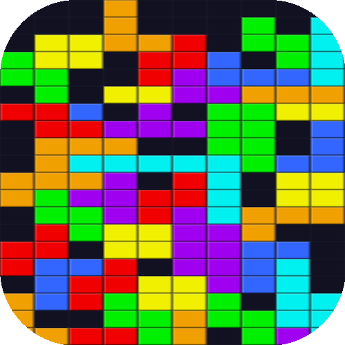

<div id="user-content-toc" align="center">
  
  <ul>
    <summary><h1>Tetris</h1></summary>
  </ul>
</div>

## About

[Tetris](https://en.wikipedia.org/wiki/Tetris) is a legendary game and one that I enjoy very much. I really love the game and enjoy playing it, it's a great stress reliever, so for a fun weekend project I decided to build the game, as a browser game/app designed for Desktop, using the principles of [vibe coding](https://en.wikipedia.org/wiki/Vibe_coding).

## Features

- Classic 10x20 Tetris board with smooth keyboard controls
- Standard seven-bag piece randomizer
- Hold piece and next piece previews
- Ghost piece projection showing where pieces will land
- Level-based speed curve with dynamic lock delay
- Score, lines, level, and high score tracking persisted to local storage
- Soft drop and hard drop scoring
- Pause menu with resume, restart, and quit options
- Line clear flash animation
- Background music with mute toggle (state persisted)

## How To Run Locally

From the project directory run

```bash
bash run.sh
```

The script starts a local Python HTTP server and opens the game in your browser. You can also open `index.html` directly in a browser although some browsers may restrict audio autoplay or local file APIs

## Built With

- [Claude Code CLI](https://code.claude.com/docs/en/overview)
- [Gemini CLI](https://github.com/google-gemini/gemini-cli)
- [Cha CLI](https://github.com/MehmetMHY/ch)

## Implementation Notes

- Optimized for desktop experience (not mobile)
- Pre-rendered block sprites and grid background for performance
- Uses Super Rotation System (SRS) style wall kicks for piece rotation
- Level-based timing system for gravity speed and lock delay
- High scores and mute state persisted with `localStorage`
- Background music source: [NmCCQxVBfyM](https://www.youtube.com/watch?v=NmCCQxVBfyM)

## License

Feel free to fork tweak the tuning or use this as a reference for your own Tetris experiments. Licensed under the [MIT License](./LICENSE).
